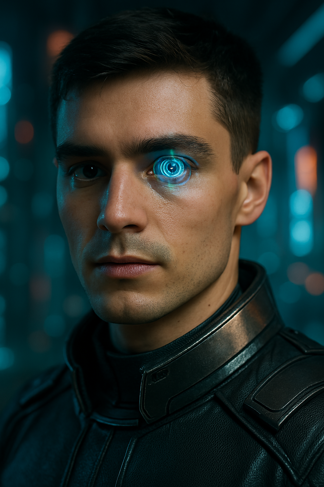

# INTRODUCTION TO THE SMART CONTACT LENS WITH AR CAPABILITIES
# 👁️ Smart AR Contact Lenses

Welcome to the **Smart AR Contact Lenses** project!  
This project is an innovative exploration into the future of wearable technology — blending **Augmented Reality (AR)** directly into **biocompatible smart contact lenses**. Our aim is to redefine how humans interact with the digital and real worlds simultaneously.


---

## 🚀 Project Vision

Imagine a world where **navigation directions**, **health monitoring**, **notifications**, and **real-time translations** appear directly within your natural field of view — **without glasses, headsets, or screens**.  

Smart AR Contact Lenses are designed to make this vision a reality by integrating:  
- Ultra-thin micro-LED/OLED displays  
- AI-powered gesture control (eye-tracking and blinking)  
- Real-time cloud processing  
- Wireless energy solutions and biosensors  

---

## ✨ Core Features

- **AR Display**: View digital overlays (maps, messages, info) directly on the lens.
- **Gesture-Based Control**: Interact with the AR interface by simply moving your eyes or blinking.
- **Health Monitoring**: Track vitals like glucose levels, hydration, and intraocular pressure.
- **Wireless Connectivity**: Communicate with smartphones and cloud services via BLE and NFC.
- **Energy Efficiency**: Powered by micro-batteries and energy harvesting technologies.

---

## 🛠️ Project Highlights

- **Miniaturized Electronics**: Integration of displays, circuits, and sensors into a thin, flexible lens.
- **AI and Cloud Integration**: Real-time processing for smooth AR experiences with minimal latency.
- **User Safety and Comfort**: Use of biocompatible, breathable materials for long-term wear.
- **Scalable Architecture**: Designed for future upgrades like 5G, haptic feedback, and AI-driven personalization.

---

## 📈 Research and Development Areas

- **Material Science**: Finding durable and transparent materials for safe lens embedding.
- **Circuit Optimization**: Reducing power consumption while maintaining processing power.
- **Software Development**: Building AR interfaces optimized for eye tracking and real-world interaction.
- **Testing and Validation**: Clinical trials to ensure safety, comfort, and effectiveness.

---

## 🔮 Future Scope

- **5G Integration**: For instant real-time cloud processing.
- **Advanced Health Diagnostics**: Early disease detection using smart biosensors.
- **Haptic Feedback Systems**: Adding micro-responses for richer interactions.
- **Expanded AR Applications**: Education, gaming, retail, security, healthcare.

---

## 👨‍💻 Team Members

- **Krishna Dwivedi** – Research & Material Science  
- **Raj Humraskar** – Electronics and Power Management  
- **Anish Kumar** – Software & AR Interface Development  
- **Arin Choubey** – System Integration, Testing & Documentation  


---

# 🔥 "Smart AR Lenses – Redefining How We See the World." 🔥


# WEBSITE

---

**This is a sample website which showcase the details of the AR Lens, different products and its working.**

## 👁️ Future Eye Experience

**Future Eye Experience** is a next-generation web application that reimagines how we interact with reality using **Smart AR Lenses**. This project fuses cutting-edge technologies — **React, TypeScript, Tailwind CSS** — to deliver an immersive, futuristic, and highly interactive experience.

---

## 🚀 Overview

Imagine a world where your **contact lenses project digital overlays** into your real-world vision.  
**Future Eye Experience** simulates this future by blending **AR interfaces** with intuitive design, highlighting the impact of smart lenses across **healthcare, navigation, education, and entertainment**.

---

## ✨ Key Features

- 🎬 **Hero Section:** Cinematic introduction with animated AR visuals.
- 🧠 **About Section:** Insights into the breakthrough technology behind smart lenses.
- 📡 **Features:** Showcase of core functionalities — health tracking, navigation overlays, device integration.
- ⚙️ **How It Works:** Deep dive into micro-electronics, cloud processing, and energy harvesting systems.
- 🛒 **Store:** E-commerce experience to browse and purchase Smart AR Lenses.
- 🔮 **Future Vision:** Exploration of next-gen possibilities like AI integration and biometric data analysis.
- 🗣️ **Testimonials:** Real-world stories showcasing transformative use cases.
- 📩 **Footer:** Contact, resources, and company information.

---

## 🛠️ Technologies Used

| Technology    | Purpose                                   |
| -------------- | ----------------------------------------- |
| **React**        | Component-based UI development           |
| **TypeScript**   | Type safety and scalable coding          |
| **Tailwind CSS** | Rapid, responsive design styling         |
| **Vite**         | Lightning-fast build tool                |
| **Framer Motion**| Smooth animations and micro-interactions |
| **Radix UI**     | Accessible and customizable UI elements  |
| **Lucide Icons** | Clean, modern icons                      |

---

## 🧩 Project Structure

```plaintext
future-eye-experience-main/
├── public/                # Static assets (images, icons)
├── src/
│   ├── components/        # Reusable React components
│   │   ├── ui/            # Core UI primitives
│   │   ├── About.tsx      # About section
│   │   ├── Features.tsx   # Features section
│   │   ├── Hero.tsx       # Hero section
│   │   ├── Store.tsx      # E-commerce store
│   │   ├── Footer.tsx     # Footer section
│   │   └── FutureVision.tsx # Future vision of AR lenses
│   ├── hooks/             # Custom React hooks
│   ├── lib/               # Utility functions
│   ├── pages/             # Page-level components
│   ├── App.tsx            # Main application entry
│   ├── main.tsx           # React DOM entry
│   └── index.css          # Global Tailwind CSS styling
├── tailwind.config.ts     # Tailwind configuration
├── vite.config.ts         # Vite configuration
└── package.json           # Project metadata and dependencies
```

---

## ⚙️ Getting Started

### Clone the repository

```bash
git clone https://github.com/Anonymous-0143/future-eye-experience.git
cd future-eye-experience-main
```

### Install Dependencies

```bash
npm install
```

### Start Development Server

```bash
npm run dev
```
> Open your browser and navigate to **http://localhost:8080** 🚀

---

## 🏗️ Build for Production

```bash
npm run build
```
> The production-ready files will be available inside the **/dist** directory.

---

## 🤝 Contributing

We welcome contributions to **Future Eye Experience**!  
- Fork the repository 🔱  
- Create a new branch 🌿  
- Make your changes 🛠️  
- Submit a pull request 📬  

---

## 📜 License

Distributed under the **MIT License**.  
Feel free to build upon and enhance this project!

---

# REPORT

## 📚 Project Overview

Augmented Reality lenses superimpose **interactive digital content** onto the real world, unlike Virtual Reality, which creates isolated experiences.  
AR lenses offer **hands-free, immersive, real-time interactions** with surroundings — transforming industries like **healthcare, education, retail, gaming, and industrial work**.

**Leading companies** (Apple, Google, Microsoft) have already shown early prototypes. Our project goes a step further by addressing **control systems, data processing, energy harvesting**, and **intuitive eye-based interactions**.

---

## ✨ Key Contributions

- Ultra-thin **Micro-LED/OLED displays** integrated into flexible, biocompatible lenses.
- **Eye tracking & blink recognition** for seamless control without external devices.
- **Energy harvesting** and **microbatteries** for long-term wear without bulky systems.
- **Edge AI processing** for real-time AR rendering and decision-making.
- **Wireless communication** via **BLE** and **NFC** for smooth device interaction.
- Full system integration combining **display, control, and AI** — not just isolated features.

---

## 🔍 Literature Review

| Contributor         | Contribution Area                                  |
|----------------------|----------------------------------------------------|
| **Krishna Dwivedi**  | Material Research & Lens Design                   |
| **Raj Humraskar**    | Electronics Integration & Power Optimization      |
| **Anish Kumar**      | Software, AR Interface, and AI-based Interaction   |
| **Arin Choubey**     | System Integration, Testing, Validation           |

Each team member played a vital role in building a **functional, safe, and innovative prototype**.

---

## 🕵️ Research Gap & Novelty

Existing patents focus mainly on **hardware displays** or **external controls** without seamless real-time AR experiences.  
Our solution:
- Combines **real-time AR display** with **intuitive control** via **eye gestures**.
- Provides **instant processing** and **adaptive AI personalization**.
- Enables **hands-free external device control** directly from the lens.

---

## 🛠️ Methodology (Step-by-Step)

1. **Research & Requirement Analysis:**  
   - Studied latest wearables, AR systems, and ocular health standards.

2. **Material Selection & Fabrication:**  
   - Developed prototypes using biocompatible, transparent materials.

3. **Circuit Design & Power Management:**  
   - Designed low-heat, low-power circuits; implemented energy harvesting.

4. **Software Integration:**  
   - Built gesture-recognition AI and real-time cloud-assisted AR interfaces.

5. **Testing & Validation:**  
   - Conducted lab tests, user trials, and regulatory compliance checks.

6. **Deployment Strategy:**  
   - Scaling production, preparing commercialization, and future AI upgrades.

---

## 📈 Discussion & Results

- Successfully integrated **high-resolution micro-LED displays** without impairing vision.
- Achieved **gesture-based AR control** with **minimal latency**.
- Optimized **power management**, enabling **longer battery life** under real-world conditions.
- Verified **secure wireless connectivity** (BLE, NFC) for real-time operation.
- Identified areas for improvement (comfort during prolonged wear, advanced battery optimization).

---

## 🌟 Future Scope

- **5G Integration** for real-time cloud AR processing.
- **Advanced AI personalization** for dynamic AR overlays.
- **Haptic Feedback** inside lenses for deeper interaction.
- **Expanded health monitoring** capabilities (hydration, pressure, glucose).
- **Continuous optimization** for comfort, safety, and user experience.

---

## 📚 References

- Lee, S. H., Kim, H., & Park, J. (2022). *Advancements in Smart Contact Lenses: Display and Biosensing Capabilities.*
- Smith, R., & Johnson, M. (2021). *Augmented Reality in Wearables: Emerging Trends.*
- Wang, Y., & Chen, Z. (2020). *Power Management for Miniaturized Wearables.*
- Patel, K., & Gupta, R. (2019). *Eye-Tracking and Gesture Recognition for AR.*
- WHO Publications (2023). *Safety Standards for Medical Wearables.*

---

